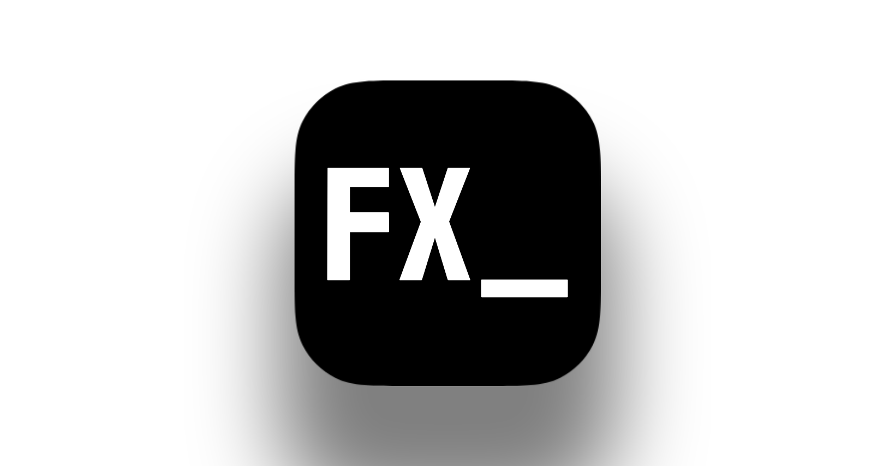

# TermFX

[English](README.md) | [Türkçe](README.tr.md)



Native video editor with FFmpeg rendering, layered effects, timeline editing,
project history, and MCP tools for AI-assisted editing.

TermFX Studio is a desktop editing application. It provides project creation,
recent projects, timeline sequencing, clip inspection, layered effect stacks,
transform keyframes, render controls, and an MCP endpoint so an AI assistant can
inspect media, cut clips, apply effects, and prepare smart edit plans through
JSON-RPC tools.

## Purpose

TermFX focuses on three editing workflows:

- **Sequencing:** Add media to a timeline, trim clips, cut ranges, ripple-delete
  gaps, and mix audio.
- **Effects and compositing:** Build FFmpeg complex filtergraphs for text
  overlays, fades, black-and-white, glitch, and `s_shake`-style motion effects.
- **AI control:** Let Claude, ChatGPT, or another MCP client operate the editor
  through stdio MCP or the embedded HTTP MCP endpoint.

The current repository is a production-oriented core implementation: project
serialization, the timeline model, FFmpeg command generation, the desktop UI,
legacy CLI utilities, and MCP tool handlers are already wired together.

## Features

- Rust + Tokio architecture
- FFmpeg complex filtergraph builder
- Frame-based timeline model
- Separate video and audio tracks
- Clip append, trim, and ripple delete
- Clip speed changes, track mute/lock, and timeline markers
- Transform keyframes with easing
- Keyframe graph export as JSON, ASCII, or SVG
- Native desktop app:
  - home screen
  - project creation and opening
  - recent project history
  - project settings for resolution, FPS, and sample rate
  - media pool
  - viewer surface
  - visual timeline
  - clip inspector
  - effect browser
  - keyframe editor
  - render panel
  - MCP activity panel
- Effect stack support:
  - `black_and_white`
  - `sepia`
  - `invert`
  - `edge_detect`
  - `glitch`
  - `brightness_contrast`
  - `hue_rotate`
  - `gaussian_blur`
  - `box_blur`
  - `sharpen`
  - `vignette`
  - `film_grain`
  - `pixelate`
  - `chromatic_aberration`
  - `lens_distortion`
  - `posterize`
  - `letterbox`
  - `border`
  - `fade_in`
  - `fade_out`
  - `s_shake`
  - `text_overlay`
- Optional legacy TUI built with Ratatui and Crossterm
- Desktop-started HTTP MCP endpoint with a live AI activity panel
- MCP stdio server:
  - `list_media`
  - `list_effects`
  - `import_media`
  - `append_media`
  - `add_text_clip`
  - `cut_video`
  - `apply_effect`
  - `remove_effect`
  - `set_effect_enabled`
  - `update_clip`
  - `move_clip`
  - `split_clip`
  - `remove_clip`
  - `add_keyframe`
  - `remove_keyframe`
  - `keyframe_graph`
  - `add_marker`
  - `remove_marker`
  - `add_track`
  - `set_track_state`
  - `set_timeline_settings`
  - `render_command`
  - `smart_edit`
- JSON project file format
- Tested baseline render path

## Requirements

- macOS, Linux, or Windows
- Rust toolchain
- FFmpeg and FFprobe
- GitHub CLI (`gh`) only if you want to publish changes to GitHub

On macOS:

```bash
brew install rust ffmpeg gh
```

If Rust is already installed:

```bash
brew install ffmpeg gh
```

Verify the installation:

```bash
rustc --version
cargo --version
ffmpeg -version
ffprobe -version
gh --version
```

## Installation

Clone the repository:

```bash
git clone https://github.com/shazeus/TermFX.git
cd TermFX
```

Build the project:

```bash
cargo build
```

Run the tests:

```bash
cargo test
```

Show CLI help:

```bash
cargo run -- --help
```

## Quick Start

Start the desktop app:

```bash
cargo run --bin termfx-studio
```

You can also launch it through the multi-command binary:

```bash
cargo run -- studio
```

Inside the app:

- Create or open a project from the home screen.
- Set resolution, FPS, and sample rate in project settings.
- Import media from the media panel.
- Append clips to the visual timeline.
- Select clips to adjust timing, opacity, volume, speed, effects, and keyframes.
- Render from the render panel.
- Use the MCP panel to expose the current project to an AI client.

The desktop app starts the local MCP endpoint when a project is opened:

```text
http://127.0.0.1:4739/mcp
```

Legacy command-line project creation is still available for automation:

```bash
cargo run -- new --name demo --project termfx.project.json
cargo run -- add-media --project termfx.project.json --path ./shot.mp4 --kind video
cargo run -- add-clip \
  --project termfx.project.json \
  --media-id 6508eba6-7a9b-4eea-b9d0-6f7b92835c18 \
  --track 0 \
  --start-seconds 0 \
  --duration-seconds 5
```

Preview the FFmpeg command without rendering:

```bash
cargo run -- render \
  --project termfx.project.json \
  --output out.mp4 \
  --dry-run
```

Render the video:

```bash
cargo run -- render \
  --project termfx.project.json \
  --output out.mp4
```

## MCP Server

The normal interactive workflow is to start the desktop app. It exposes the
current project over local HTTP and shows AI activity in the MCP panel:

```bash
cargo run --bin termfx-studio
```

HTTP endpoint:

```text
http://127.0.0.1:4739/mcp
```

For MCP clients that support HTTP endpoints, configure the server URL:

```json
{
  "mcpServers": {
    "termfx": {
      "url": "http://127.0.0.1:4739/mcp"
    }
  }
}
```

You can also run the same HTTP server without the desktop app for testing:

```bash
cargo run -- mcp-http --project termfx.project.json --port 4739
```

Some MCP clients only support stdio. For those clients, run the TermFX MCP
server over stdio:

```bash
cargo run -- mcp --project termfx.project.json
```

Example MCP client configuration:

```json
{
  "mcpServers": {
    "termfx": {
      "command": "cargo",
      "args": [
        "run",
        "--manifest-path",
        "/absolute/path/to/TermFX/Cargo.toml",
        "--",
        "mcp",
        "--project",
        "/absolute/path/to/project/termfx.project.json"
      ]
    }
  }
}
```

Supported MCP lifecycle methods:

- `initialize`
- `notifications/initialized`
- `ping`
- `tools/list`
- `tools/call`

## MCP Tool Examples

List media and timeline state:

```json
{
  "jsonrpc": "2.0",
  "id": 1,
  "method": "tools/call",
  "params": {
    "name": "list_media",
    "arguments": {}
  }
}
```

List the built-in effect library:

```json
{
  "jsonrpc": "2.0",
  "id": 7,
  "method": "tools/call",
  "params": {
    "name": "list_effects",
    "arguments": {}
  }
}
```

Import media through MCP:

```json
{
  "jsonrpc": "2.0",
  "id": 8,
  "method": "tools/call",
  "params": {
    "name": "import_media",
    "arguments": {
      "path": "/absolute/path/to/shot.mp4",
      "kind": "video",
      "name": "shot"
    }
  }
}
```

Append media to the timeline:

```json
{
  "jsonrpc": "2.0",
  "id": 2,
  "method": "tools/call",
  "params": {
    "name": "append_media",
    "arguments": {
      "media_id": "6508eba6-7a9b-4eea-b9d0-6f7b92835c18",
      "track": 0,
      "start_seconds": 0,
      "duration_seconds": 5
    }
  }
}
```

Add a dedicated text clip:

```json
{
  "jsonrpc": "2.0",
  "id": 9,
  "method": "tools/call",
  "params": {
    "name": "add_text_clip",
    "arguments": {
      "track": 1,
      "text": "INTRO",
      "start_seconds": 0,
      "duration_seconds": 2
    }
  }
}
```

Cut a timeline range with ripple delete:

```json
{
  "jsonrpc": "2.0",
  "id": 3,
  "method": "tools/call",
  "params": {
    "name": "cut_video",
    "arguments": {
      "mode": "remove_range",
      "start_seconds": 1.2,
      "end_seconds": 2.1,
      "ripple": true
    }
  }
}
```

Split a clip at a timeline timestamp:

```json
{
  "jsonrpc": "2.0",
  "id": 10,
  "method": "tools/call",
  "params": {
    "name": "split_clip",
    "arguments": {
      "clip_id": "33c6f411-29d9-4e77-b606-4f444c0b5817",
      "at_seconds": 2.5
    }
  }
}
```

Update clip timing, speed, and mix parameters:

```json
{
  "jsonrpc": "2.0",
  "id": 11,
  "method": "tools/call",
  "params": {
    "name": "update_clip",
    "arguments": {
      "clip_id": "33c6f411-29d9-4e77-b606-4f444c0b5817",
      "speed": 1.25,
      "opacity": 0.85,
      "volume": 0.6
    }
  }
}
```

Add transform keyframes with easing:

```json
{
  "jsonrpc": "2.0",
  "id": 14,
  "method": "tools/call",
  "params": {
    "name": "add_keyframe",
    "arguments": {
      "clip_id": "33c6f411-29d9-4e77-b606-4f444c0b5817",
      "time_seconds": 1,
      "x": 120,
      "y": 80,
      "scale": 0.85,
      "rotation_degrees": 8,
      "opacity": 1,
      "volume": 1,
      "easing": "ease_in_out"
    }
  }
}
```

Export a keyframe graph as SVG:

```json
{
  "jsonrpc": "2.0",
  "id": 15,
  "method": "tools/call",
  "params": {
    "name": "keyframe_graph",
    "arguments": {
      "clip_id": "33c6f411-29d9-4e77-b606-4f444c0b5817",
      "property": "x",
      "format": "svg",
      "width": 640,
      "height": 240
    }
  }
}
```

Add a timeline marker:

```json
{
  "jsonrpc": "2.0",
  "id": 16,
  "method": "tools/call",
  "params": {
    "name": "add_marker",
    "arguments": {
      "time_seconds": 8.5,
      "label": "Beat drop",
      "color": "cyan",
      "note": "Cut b-roll here"
    }
  }
}
```

Apply an `s_shake` effect to a clip:

```json
{
  "jsonrpc": "2.0",
  "id": 4,
  "method": "tools/call",
  "params": {
    "name": "apply_effect",
    "arguments": {
      "clip_id": "33c6f411-29d9-4e77-b606-4f444c0b5817",
      "effect": "s_shake",
      "params": {
        "amplitude_px": 18,
        "frequency_hz": 10,
        "seed": 0.4
      }
    }
  }
}
```

Apply a cinematic lens effect:

```json
{
  "jsonrpc": "2.0",
  "id": 12,
  "method": "tools/call",
  "params": {
    "name": "apply_effect",
    "arguments": {
      "clip_id": "33c6f411-29d9-4e77-b606-4f444c0b5817",
      "effect": "vignette",
      "params": {
        "angle": 0.7
      }
    }
  }
}
```

Add a text overlay:

```json
{
  "jsonrpc": "2.0",
  "id": 5,
  "method": "tools/call",
  "params": {
    "name": "apply_effect",
    "arguments": {
      "clip_id": "33c6f411-29d9-4e77-b606-4f444c0b5817",
      "effect": "text_overlay",
      "params": {
        "text": "FINAL CUT",
        "x": 120,
        "y": 80,
        "font_size": 56,
        "color": "white",
        "start_seconds": 0,
        "duration_seconds": 2.5
      }
    }
  }
}
```

Build the FFmpeg render command without executing it:

```json
{
  "jsonrpc": "2.0",
  "id": 13,
  "method": "tools/call",
  "params": {
    "name": "render_command",
    "arguments": {
      "output": "out.mp4"
    }
  }
}
```

Create a silence or beat-sync analysis plan:

```json
{
  "jsonrpc": "2.0",
  "id": 6,
  "method": "tools/call",
  "params": {
    "name": "smart_edit",
    "arguments": {
      "mode": "silence",
      "threshold_db": -35,
      "min_silence_seconds": 0.35,
      "dry_run": true
    }
  }
}
```

## Desktop UI

The desktop workspace is organized into media, viewer, inspector, timeline, and
MCP status panels:

```text
+--------------------------------------------------------------------------------+
| TermFX Studio         Home  Save  Render  Start MCP          1920 x 1080 30 fps |
+----------------------+------------------------------------+--------------------+
| Media                | Viewer                             | Inspector          |
| - shot_01.mp4        | +------------- frame ------------+ | Clip               |
| - music.wav          | | selected clip summary          | | Effects            |
| - logo.png           | | render/open output controls    | | Keyframes          |
|                      | +---------------------------------+ | Project / MCP       |
+----------------------+------------------------------------+--------------------+
| Timeline & Layers                                                             |
| time    |0------------------------------|-----------------------------------> |
| V2      |........TITLE######...................................................|
| V1      |intro############....broll#############....outro########..............|
| A1      |music================================================================|
+--------------------------------------------------------------------------------+
| MCP  list_media ok | apply_effect s_shake queued | render ready                 |
+--------------------------------------------------------------------------------+
```

## Project Structure

```text
src/
  bin/
    termfx-studio.rs   Native desktop app entrypoint
  core/
    effect.rs          Effect, easing, and keyframe graph data types
    media.rs           Media asset model
    smart.rs           Smart edit analysis plan
    time.rs            FPS and frame/seconds conversion
    timeline.rs        Tracks, clips, markers, keyframes, trim, and ripple delete
  mcp/
    protocol.rs        JSON-RPC request/response types
    server.rs          MCP stdio server loop
    tools.rs           MCP tool schemas and handlers
  render/
    ffmpeg.rs          FFmpeg command and filtergraph builder
    filtergraph.rs     Escaping and time helpers
    progress.rs        Render progress model
  desktop/
    mod.rs             Desktop app, project hub, editor panels, MCP activity
  tui/
    app.rs             Optional legacy text UI lifecycle and event loop
    layout.rs          Optional legacy text UI panel layout
    timeline_widget.rs Optional legacy timeline drawing
  project.rs           JSON project model
  main.rs              CLI entrypoint
```

Detailed Turkish architecture notes:

[ARCHITECTURE_TR.md](ARCHITECTURE_TR.md)

## Development

Format:

```bash
cargo fmt
```

Test:

```bash
cargo test
```

Dry-run render:

```bash
cargo run -- render \
  --project termfx.project.json \
  --output out.mp4 \
  --dry-run
```

## Status

TermFX is in active development. The core timeline, MCP tool handlers,
keyframe graphing, and FFmpeg render path are functional. Planned production
work includes:

- Automatic media metadata extraction with FFprobe
- Background render queue and progress parsing
- Preview cache, waveform, and proxy systems
- Turning smart edit plans into real timeline mutations
- MCP resource support

## License

MIT
